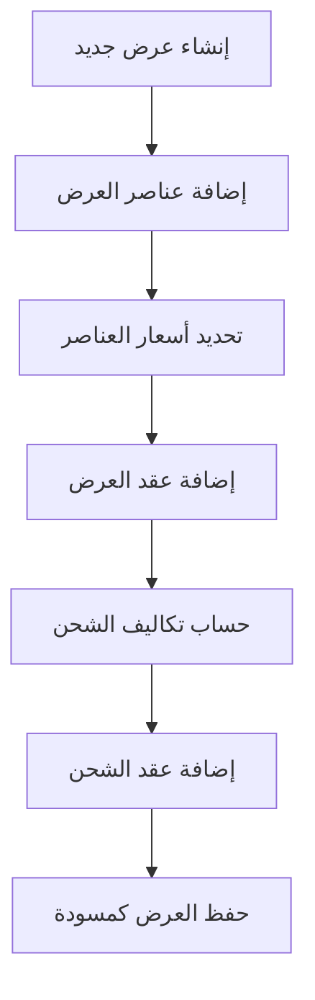
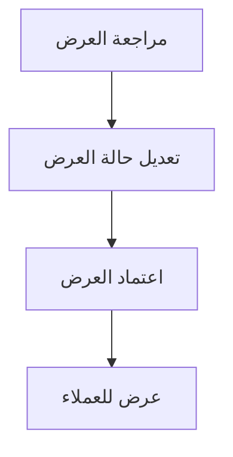
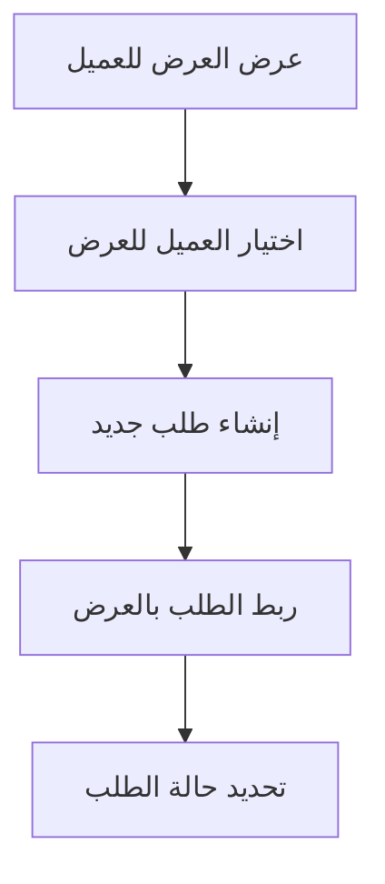
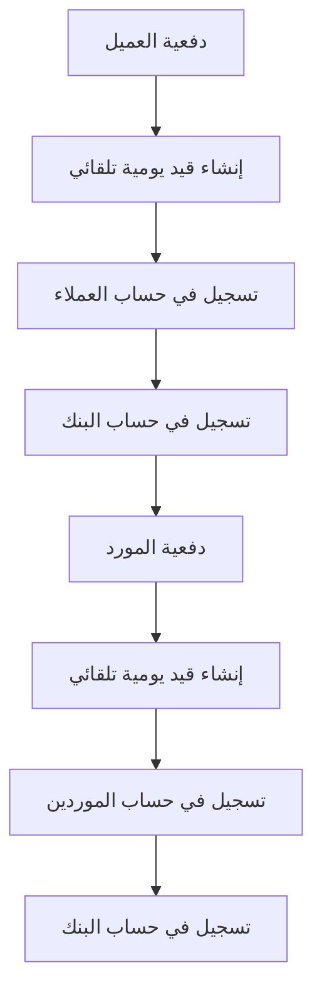

# 🏢 نظام إدارة سلسلة التوريد (SCM) - Supply Chain Management System

## 📋 نظرة عامة

نظام إدارة سلسلة التوريد هو نظام شامل مبني على **Microservices Architecture** باستخدام **.NET 8.0** و **Entity Framework Core**. يدعم النظام دورة حياة كاملة للعروض التجارية من إنشاء العروض إلى الدفع والمحاسبة.

## 🏗️ هيكل النظام

### الميكروسيرفيسات الحالية:

| الميكروسيرفيس | المنفذ | الوصف |
|-------------|--------|--------|
| **Identity.Api** | 5001 | إدارة المستخدمين والمصادقة |
| **Suppliers.Api** | 5002 | إدارة الموردين والعروض |
| **Inventory.Api** | 5003 | إدارة المخزون والمستودعات |
| **Customer.Api** | 7266 | إدارة العملاء |
| **Admin.Api** | 7266 | إدارة النظام |
| **Order.Api** | 5005 | إدارة الطلبات |
| **Payments.Api** | 5007 | إدارة المدفوعات |
| **Accounting.Api** | 5009 | الحسابات المحاسبية |
| **API Gateway** | 7034 | بوابة الواجهة البرمجية |

## 🗄️ قاعدة البيانات

### قواعد البيانات المنفصلة:
- **SuppliersDB** - بيانات الموردين والعروض
- **InventoryDB** - بيانات المخزون والمستودعات  
- **OrderDB** - بيانات الطلبات
- **IdentityDB** - بيانات المستخدمين والمصادقة
- **CustomerDB** - بيانات العملاء
- **AdminDB** - بيانات الإدارة

## 🔄 دورة حياة العرض

### 1️⃣ إنشاء العرض


### 2️⃣ اعتماد العرض


### 3️⃣ طلب العميل


### 4️⃣ الدفع والمحاسبة


## 📊 الجداول المحاسبية

### دليل الحسابات (ChartOfAccounts)
```sql
-- الأصول (Assets)
101 - البنك
102 - النقدية  
103 - العملاء
104 - المخزون
105 - الأصول الثابتة

-- الخصوم (Liabilities)
201 - الموردين
202 - الضرائب المستحقة
203 - الرواتب المستحقة

-- حقوق الملكية (Equity)
301 - رأس المال
302 - الأرباح المحتجزة
303 - صافي الدخل

-- الإيرادات (Revenue)
401 - المبيعات
402 - إيرادات الخدمات
403 - إيرادات أخرى

-- المصروفات (Expenses)
501 - المشتريات
502 - تكاليف الشحن
503 - المصروفات الإدارية
504 - المصروفات التشغيلية
505 - مصروفات التسويق
506 - مصروفات أخرى
```

### قيود اليومية (JournalEntries)
- **قيود يدوية** - إنشاء يدوي للقيود المحاسبية
- **قيود تلقائية** - إنشاء تلقائي عند الدفع
- **قيود الطلبات** - ربط القيود بالطلبات

## 🔌 API Endpoints

### Payments.Api
```
GET    /api/payment/customer-payments          # دفعيات العملاء
POST   /api/payment/customer-payments          # إنشاء دفعية عميل
GET    /api/payment/supplier-payments          # دفعيات الموردين
POST   /api/payment/supplier-payments          # إنشاء دفعية مورد
GET    /api/payment/payment-methods            # طرق الدفع
GET    /api/payment/currencies                 # العملات
GET    /api/payment/statistics                 # إحصائيات المدفوعات
```

### Accounting.Api
```
GET    /api/accounting/chart-of-accounts       # دليل الحسابات
POST   /api/accounting/chart-of-accounts       # إنشاء حساب جديد
GET    /api/accounting/journal-entries         # قيود اليومية
POST   /api/accounting/journal-entries         # إنشاء قيد يومية
POST   /api/accounting/journal-entries/{id}/post # إرسال قيد اليومية
GET    /api/accounting/trial-balance           # ميزان المراجعة
GET    /api/accounting/income-statement        # قائمة الدخل
POST   /api/accounting/customer-payment-journal-entry # قيد دفعية عميل
POST   /api/accounting/supplier-payment-journal-entry # قيد دفعية مورد
```

## 🚀 كيفية تشغيل النظام

### 1️⃣ إعداد قاعدة البيانات
```sql
-- تشغيل ملف DatabaseUpdates.sql
-- إنشاء الجداول المحاسبية الجديدة
-- إضافة AccountId لجدول الموردين
```

### 2️⃣ تشغيل الميكروسيرفيسات
```bash
# تشغيل API Gateway
cd APIGateWay
dotnet run

# تشغيل Payments.Api
cd Payments.Api
dotnet run

# تشغيل Accounting.Api
cd Accounting.Api
dotnet run

# تشغيل باقي الميكروسيرفيسات...
```

### 3️⃣ اختبار النظام
```bash
# اختبار Payments.Api
curl -X GET "https://localhost:5008/api/payment/payment-methods"

# اختبار Accounting.Api
curl -X GET "https://localhost:5010/api/accounting/chart-of-accounts"
```

## 🔐 الأمان

- **JWT Authentication** - مصادقة باستخدام JWT tokens
- **CORS** - دعم الطلبات من مصادر مختلفة
- **HTTPS** - تشفير الاتصالات
- **Role-based Authorization** - صلاحيات المستخدمين

## 📈 التقارير المتاحة

### تقارير المدفوعات
- إجمالي دفعيات العملاء
- إجمالي دفعيات الموردين
- صافي المبلغ
- إحصائيات حسب طريقة الدفع
- إحصائيات حسب العملة

### التقارير المحاسبية
- **ميزان المراجعة** - أرصدة جميع الحسابات
- **قائمة الدخل** - الإيرادات والمصروفات
- **الميزانية العمومية** - الأصول والخصوم وحقوق الملكية
- **إحصائيات محاسبية** - تحليل شامل للعمليات

## 🔄 التكامل بين الميكروسيرفيسات

### سير العمل المتكامل:
1. **إنشاء عرض** في Suppliers.Api
2. **اعتماد العرض** وتغيير حالته
3. **إنشاء طلب** في Order.Api مرتبط بالعرض
4. **معالجة الدفع** في Payments.Api
5. **إنشاء قيود محاسبية** تلقائياً في Accounting.Api
6. **تحديث المخزون** في Inventory.Api

## 📝 ملاحظات مهمة

### أفضل الممارسات:
- ✅ **Database per Service** - قاعدة بيانات منفصلة لكل ميكروسيرفيس
- ✅ **JWT Authentication** - مصادقة موحدة عبر جميع الخدمات
- ✅ **CORS Configuration** - دعم الطلبات من الواجهات الأمامية
- ✅ **Logging** - تسجيل شامل باستخدام Serilog
- ✅ **Health Checks** - مراقبة صحة الخدمات
- ✅ **Swagger Documentation** - توثيق API شامل

### التطوير المستقبلي:
- 🔄 **Event-Driven Architecture** - استخدام Message Queues
- 🔄 **Caching** - إضافة Redis للتحسين
- 🔄 **Monitoring** - إضافة Application Insights
- 🔄 **Notifications** - نظام إشعارات متقدم
- 🔄 **Reports** - ميكروسيرفيس تقارير منفصل

## 🆘 استكشاف الأخطاء

### مشاكل شائعة:
1. **خطأ الاتصال بقاعدة البيانات** - تحقق من connection string
2. **خطأ المصادقة** - تحقق من JWT settings
3. **خطأ CORS** - تحقق من إعدادات CORS
4. **خطأ المنافذ** - تأكد من عدم تعارض المنافذ

### ملفات السجلات:
- `logs/payments-microservice-*.txt` - سجلات Payments.Api
- `logs/accounting-microservice-*.txt` - سجلات Accounting.Api

---

## 📞 الدعم

للمساعدة أو الاستفسارات، يرجى مراجعة:
- ملفات السجلات للتشخيص
- Swagger UI لكل ميكروسيرفيس
- توثيق API في كل خدمة

**تم تطوير النظام باستخدام أحدث التقنيات وأفضل الممارسات في تطوير الميكروسيرفيسات.**
